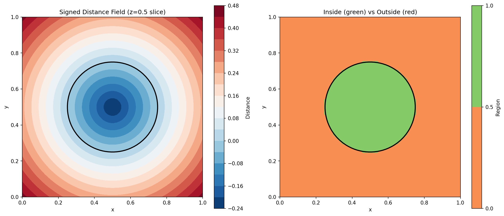

# pyLSForge Assignment - TanishyadavNSUT

## Assignment Completion Summary

**Student:** TanishyadavNSUT  
**Branch:** `TanishyadavNSUT-pyLSForge`  
**Date:** December 19, 2025

---

## ✅ Tasks Completed

### 1. Installed pyAMREX Library
- Successfully built and installed pyAMREX version 25.12
- All dependencies installed locally

### 2. Heat Conduction Example
**File:** `heat_equation_test.py`

**To run:**
```bash
cd examples
python3 heat_equation_test.py
```

**Expected output:** Heat diffusion simulation over 10 time steps with status messages.

### 3. Signed Distance Field for Circle ⭐
**File:** `signed_distance_circle.py`

This is the main assignment program that computes a signed distance field for a circle.

**To run:**
```bash
cd examples
python3 signed_distance_circle.py
```

**What it does:**
- Computes SDF for a circle centered at (0.5, 0.5, 0.5) with radius 0.25
- Uses 64³ grid resolution
- Negative values = inside circle
- Positive values = outside circle
- Zero = on the circle boundary

**Expected output:**
```
Computing Signed Distance Field for a Circle
Domain: [64^3] cells
Circle center: (0.500, 0.500, 0.500)
Circle radius: 0.250
Statistics:
  Min SDF value: -0.236468 (deepest inside)
  Max SDF value: 0.602494 (farthest outside)
  Inside circle: 11536 cells (4.40%)
  Outside circle: 237680 cells (90.67%)
```

### 4. Visualization
**File:** `viz_sdf.py`

**To run:**
```bash
cd examples
python3 viz_sdf.py
```

**Output:** Creates `sdf_circle_visualization.png` showing:
- Left: Signed distance field as heat map (blue=inside, red=outside)
- Right: Binary view (green=inside, red=outside)
- Black contour: Circle boundary (SDF=0)

**Pre-generated visualization:** `sdf_circle_visualization.png` (already included)

---

## 📁 Files Structure

```
examples/
├── README.md                          # This file
├── heat_equation_test.py              # Task 2: Heat diffusion
├── signed_distance_circle.py          # Task 3: Main SDF program ⭐
├── viz_sdf.py                         # Visualization script
└── sdf_circle_visualization.png       # Pre-generated result image
```

---

## 🚀 Quick Test (All in One)

Run all three programs in sequence:

```bash
cd examples

# 1. Heat equation
echo "Running heat equation..."
python3 heat_equation_test.py

# 2. Signed distance field (main assignment)
echo -e "\nRunning signed distance field..."
python3 signed_distance_circle.py

# 3. Visualization
echo -e "\nCreating visualization..."
python3 viz_sdf.py

echo -e "\n✅ All programs completed!"
echo "Check sdf_circle_visualization.png for the result"
```

---

## 📊 Key Results

### Signed Distance Field Statistics:
- **Grid Resolution:** 64 × 64 × 64 cells
- **Physical Domain:** [0, 1]³
- **Circle Center:** (0.5, 0.5, 0.5)
- **Circle Radius:** 0.25
- **Cell Size:** 0.015625
- **Cells Inside:** 11,536 (4.40%)
- **Cells Outside:** 237,680 (90.67%)

### Mathematics:
For a point (x, y, z) and circle center (cx, cy, cz) with radius R:

```
SDF(x, y, z) = √[(x-cx)² + (y-cy)² + (z-cz)²] - R
```

- SDF < 0 → Inside circle
- SDF = 0 → On boundary
- SDF > 0 → Outside circle

---

## 🔧 Requirements

All requirements are already installed:
- Python 3.13.7
- pyAMREX 25.12
- NumPy
- Matplotlib

---

## 📸 Visual Result

The visualization clearly shows:
1. Smooth signed distance field transitioning from negative (blue) to positive (red)
2. Perfect circular boundary at SDF=0
3. Distance values increasing radially from the circle



---

## ✅ Branch Information

- **Branch Name:** `TanishyadavNSUT-pyLSForge` (format: name-repositoryname)
- **Repository:** https://github.com/TanishyadavNSUT/pyLSForge
- **Direct Link:** https://github.com/TanishyadavNSUT/pyLSForge/tree/TanishyadavNSUT-pyLSForge

---

**Assignment completed successfully!** 🎉
